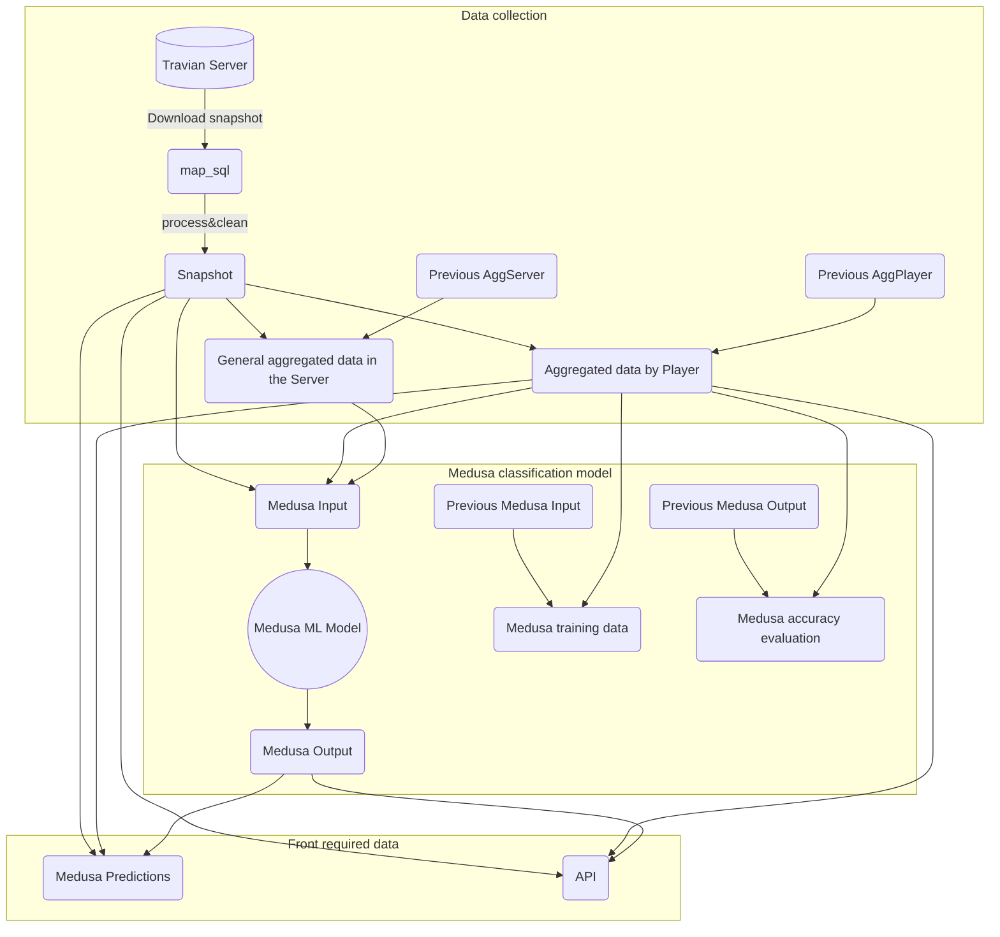

# MyTravian

Is [TheRedNatar's](https://www.therednatar.com) core engine to compute, store and analyse Travian's data.

The data graph is the next one

```mermaid
graph TD;
    ts[(Travian Server)];
    map_sql(map_sql);
    snapshot(Snapshot);

    agg_players(Aggregated data by Player);
    prev_agg_players(Previous AggPlayer);

    agg_server(General aggregated data in the Server);
    prev_agg_server(Previous AggServer);

    medusa_pi(Medusa Input);
    medusa_model((Medusa ML Model));
    medusa_po(Medusa Output);

    prev_medusa_pi(Previous Medusa Input);
    medusa_train(Medusa training data);

    prev_medusa_po(Previous Medusa Output);
    medusa_score(Medusa accuracy evaluation);

    s_medusa_pred(Medusa Predictions);
    apimapsql(API);

    subgraph Data collection
    ts -- Download snapshot-->map_sql;
    map_sql -- process&clean --> snapshot;

    snapshot --> agg_players;
    prev_agg_players --> agg_players;
    snapshot --> agg_server;
    prev_agg_server --> agg_server;
    end


    subgraph Medusa classification model
    snapshot --> medusa_pi;
    agg_players --> medusa_pi;
    agg_server --> medusa_pi;

    medusa_pi --> medusa_model --> medusa_po;

    prev_medusa_po --> medusa_score;
    agg_players --> medusa_score;

    prev_medusa_pi --> medusa_train;
    agg_players --> medusa_train;
    end


    subgraph Front required data
    snapshot --> s_medusa_pred;
    agg_players --> s_medusa_pred;
    medusa_po --> s_medusa_pred;

    snapshot --> apimapsql;
    agg_players --> apimapsql;
    medusa_po --> apimapsql;
    end

```
